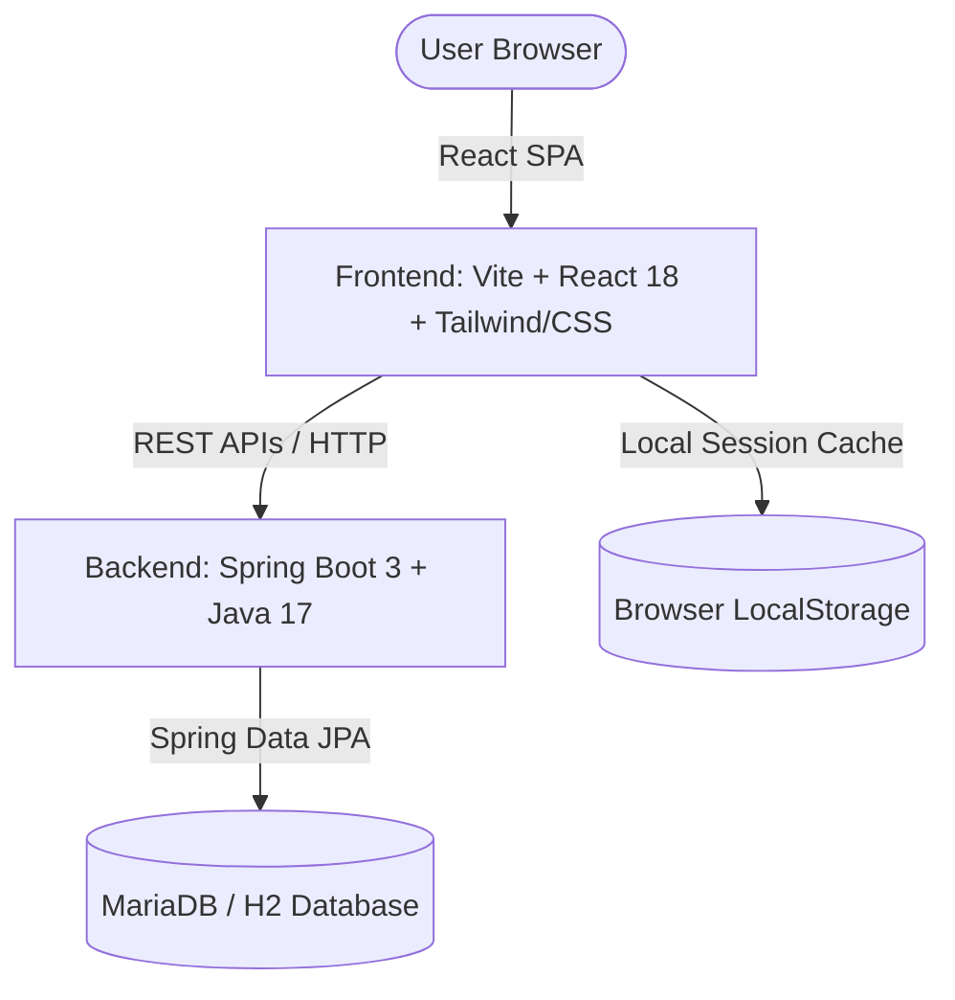

# StandupFlow — Agile Project & Team Performance Management Platform

StandupFlow is an enterprise-grade Agile Project Management & Developer Workspace platform built with Spring Boot 3 (Java 17) backend REST APIs and a React + Vite frontend. It streamlines sprint planning, task tracking, bug reporting, team chat messaging, and employee health analytics.

---

## Interactive Documentation Table of Contents

- [1. System Architecture & Tech Stack](#1-system-architecture--tech-stack)
- [2. User Roles & Access Control (RBAC)](#2-user-roles--access-control-rbac)
- [3. Comprehensive Module Guide](#3-comprehensive-module-guide)
  - [3.1 Authentication & Interactive Spotlight Tour](#31-authentication--interactive-spotlight-tour)
  - [3.2 Role-Based Dashboards (Manager, Developer, Tester)](#32-role-based-dashboards-manager-developer-tester)
  - [3.3 Task & Backlog Management (Kanban, Table, Backlog)](#33-task--backlog-management-kanban-table-backlog)
  - [3.4 Sprint Planning & Execution](#34-sprint-planning--execution)
  - [3.5 Issue & Bug Tracking System](#35-issue--bug-tracking-system)
  - [3.6 Team Roster & Workspace Invites](#36-team-roster--workspace-invites)
  - [3.7 WhatsApp-Style Real-time Team Chat](#37-whatsapp-style-real-time-team-chat)
  - [3.8 Health & Performance Analytics](#38-health--performance-analytics)
  - [3.9 Notifications & Settings](#39-notifications--settings)
- [4. Quick Start & Local Setup Guide](#4-quick-start--local-setup-guide)
- [5. API Endpoint Documentation](#5-api-endpoint-documentation)

---

## 1. System Architecture & Tech Stack



* **Frontend**: React 18, Vite, Lucide React Icons, Custom Design Tokens, Context API (`AppContext.jsx`).
* **Backend**: Java 17, Spring Boot 3.x, Spring Data JPA, Hibernate, Jackson JSON, RESTful Controllers.
* **Database**: MariaDB / H2 Database with JPA ORM mapping.

---

## 2. User Roles & Access Control (RBAC)

| Role | Access Level | Primary Workspace & Capabilities |
| :--- | :--- | :--- |
| **MANAGER / ADMIN** | Full Administrative Control | Create projects/sprints, assign tasks, invite/remove members, view overall analytics, manage bug reports. |
| **DEVELOPER** | Execution & Development | View assigned tasks, track active work sessions, update task status, log code changes, team chat. |
| **TESTER / QA** | Quality Assurance & Testing | Dedicated testing queue, report bugs via `BugReportModal`, link issues to tasks, mark issue resolution. |

---

## 3. Comprehensive Module Guide

### 3.1 Authentication & Interactive Spotlight Tour
* **What it does**: Handles user login, registration with role selection (Manager, Developer, Tester), and launches an interactive spotlight onboarding tour for first-time users.
* **How to Access**: 
  * Login/Register: Automatically loaded at startup or accessible via the user avatar menu -> Logout.
  * Onboarding Tour: Automatically triggers on first login or can be launched via Settings > Re-run Onboarding Tour.

---

### 3.2 Role-Based Dashboards (Manager, Developer, Tester)
* **What it does**:
  * **Manager Dashboard**: Displays project health metrics, sprint velocity, overdue tasks, team workload distribution, and recent activity streams.
  * **Developer Dashboard**: Displays assigned tasks, upcoming deadlines, personal story points completed, and active session timer.
  * **Tester Dashboard**: Displays open bug reports, test pass/fail ratios, pending testing tasks, and unresolved issue queues.
* **How to Access**: Click Dashboard in the main left sidebar navigation.

---

### 3.3 Task & Backlog Management (Kanban, Table, Backlog)
* **What it does**: Full lifecycle management of tasks with story point allocation, priority tags, assignees, and sprint mapping.
  * **Kanban Board**: Drag-and-drop or status column view (Backlog, In Progress, In Review, Completed).
  * **Table View**: Compact list with column sorting, filters, and bulk status updates.
  * **Backlog View**: Unassigned or un-sprinted work items ready for planning.
* **How to Access**: Click Tasks in the left sidebar, then toggle between Kanban, Table, or Backlog tabs at the top.

---

### 3.4 Sprint Planning & Execution
* **What it does**: Enables managers to create sprints with start/end dates, target goals, and total story points. Calculates real-time sprint completion percentages.
* **How to Access**: Click Sprints in the left sidebar to view active sprints, sprint metrics, or click Create Sprint.

---

### 3.5 Issue & Bug Tracking System
* **What it does**: Comprehensive bug reporting tool with severity levels (Critical, High, Medium, Low), steps to reproduce, actual vs. expected results, environment details, and linked task associations.
* **How to Access**: 
  * Click Issues / Bugs in the left sidebar.
  * Click Report Bug button (available in Tester Dashboard & Task Details Drawer) to launch `BugReportModal`.

---

### 3.6 Team Roster & Workspace Invites
* **What it does**: Displays active project workspace assignees, invite code generator, email invitation system (`sendInvitation`), and member removal functionality for Managers.
* **How to Access**: Click Team Members in the left sidebar.

---

### 3.7 WhatsApp-Style Real-time Team Chat
* **What it does**: Real-time team messaging featuring 1-on-1 Direct Messages and Group Channels (`#general`, `#dev-team`). Supports file/photo attachments, unread message badges, and "Delete for Everyone" soft-delete placeholder (`You deleted this message` / `This message was deleted`).
* **How to Access**: Click Team Chat in the left sidebar navigation.

---

### 3.8 Health & Performance Analytics
* **What it does**: Tracks developer burnout risk, workload distribution, project risk scores, performance reviews, and delivery rate metrics.
* **How to Access**: Click Health & Analytics in the left sidebar to toggle between Employee Health, Project Health, and Performance Reviews.

---

### 3.9 Notifications & Settings
* **What it does**:
  * **Notifications**: Centralized feed for task assignments, issue updates, and project invitations.
  * **Settings**: Update profile info (name, department, avatar), manager invite code, dark/light theme options, and API endpoint config.
* **How to Access**: Click the Bell Icon (Notifications) or Settings gear icon in the top header / sidebar.

---

## 4. Quick Start & Local Setup Guide

### Prerequisites
* **Node.js** (v18+) & `npm`
* **Java Development Kit (JDK 17+)**
* **Maven** (or bundled `./mvnw`)

### 1. Run Backend (Spring Boot REST API)
```bash
cd backend
./mvnw spring-boot:run
```
*Backend runs on `http://localhost:8080/api/v1`*

### 2. Run Frontend (React + Vite)
```bash
cd frontend
npm install
npm run dev
```
*Frontend opens on `http://localhost:5173`*

---

## 5. API Endpoint Documentation

| Method | Endpoint | Description |
| :--- | :--- | :--- |
| `POST` | `/api/v1/auth/login` | Authenticate user credentials |
| `POST` | `/api/v1/auth/register` | Register new user with assigned role |
| `GET` | `/api/v1/tasks` | Fetch all project tasks |
| `POST` | `/api/v1/tasks` | Create new task item |
| `PUT` | `/api/v1/tasks/{id}` | Update task details or status |
| `DELETE` | `/api/v1/tasks/{id}` | Delete task by ID |
| `GET` | `/api/v1/chat/messages` | Fetch all chat messages |
| `POST` | `/api/v1/chat/messages` | Send new chat message |
| `DELETE` | `/api/v1/chat/messages/{id}` | Soft-delete chat message for everyone |
| `GET` | `/api/v1/chat/channels` | Fetch group channels |
| `POST` | `/api/v1/invitations/send` | Send project workspace invitation |
